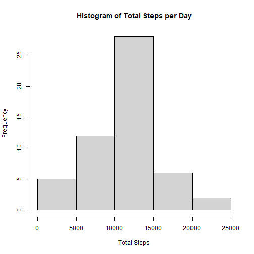
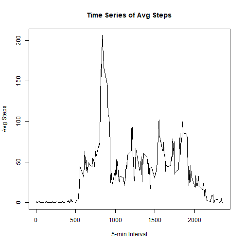
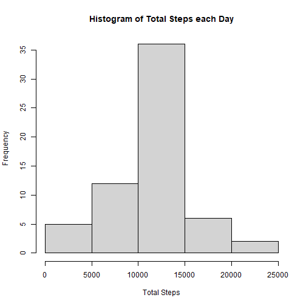
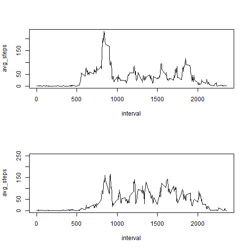

## Loading and preprocessing the data

``` r
library(dplyr)
```

```
## 
## Attaching package: 'dplyr'
```

```
## The following objects are masked from 'package:stats':
## 
##     filter, lag
```

```
## The following objects are masked from 'package:base':
## 
##     intersect, setdiff, setequal, union
```

``` r
activity_data <- read.csv(file="activity.csv", sep=",")
```
## What is mean total number of steps taken per day?

Mean steps per day is 10766.19 and Median steps per day is 10765.


``` r
sum_steps <- tapply(activity_data$steps, activity_data$date, sum)
hist(sum_steps, main="Histogram of Total Steps per Day", xlab="Total Steps")
```



``` r
mean(sum_steps, na.rm=TRUE)
```

```
## [1] 10766.19
```

``` r
median(sum_steps, na.rm=TRUE)
```

```
## [1] 10765
```
## What is the average daily activity pattern?

Maximum steps occur at interval 835 with a max step value of 206.1698.


``` r
int_steps <- aggregate(steps ~ interval, activity_data, mean)
plot(int_steps$interval, int_steps$steps, type="l", main="Time Series of Avg Steps", xlab="5-min Interval", ylab="Avg Steps")
```



``` r
max(int_steps$steps)
```

```
## [1] 206.1698
```

``` r
max_int<-which.max(int_steps$steps)
int_steps[max_int,"interval"][[1]]
```

```
## [1] 835
```
## Imputing missing values

Mean steps is still the same value of 10766.19 however the median has changed to also 10766.19. It appears imputing missing value data has an impact on median more than mean.


``` r
Na <- is.na(activity_data$steps)
sum(Na)
```

```
## [1] 2304
```

``` r
activity_imputed <- activity_data
for (i in 1:nrow(activity_imputed)) {
  if (is.na(activity_imputed$steps[i])) {
    interval_value <- activity_imputed$interval[i]
    steps_value <- int_steps[
      int_steps$interval == interval_value,]
    activity_imputed$steps[i] <- steps_value$steps
  }
}
imputed_day_steps <- aggregate(steps ~ date, activity_imputed, sum)
hist(imputed_day_steps$steps, main="Histogram of Total Steps each Day", xlab="Total Steps")
```



``` r
mean(imputed_day_steps$steps)
```

```
## [1] 10766.19
```

``` r
median(imputed_day_steps$steps)
```

```
## [1] 10766.19
```
## Are there differences in activity patterns between weekdays and weekends?

``` r
activity_imputed<-mutate(activity_imputed, weekday=weekdays(as.Date(activity_imputed$date)))
activity_imputed<-mutate(activity_imputed, weekend= if_else(weekday=="Saturday" | weekday=="Sunday", TRUE, FALSE))
activity_weekend<-filter(activity_imputed, weekend==TRUE)
activity_weekday<-filter(activity_imputed, weekend==FALSE)

int_steps_weekday<-activity_weekday %>% 
        group_by(interval) %>% 
        summarise(avg_steps=mean(steps, na.rm=TRUE))
int_steps_weekend<-activity_weekend %>% 
        group_by(interval) %>% 
        summarise(avg_steps=mean(steps, na.rm=TRUE))

par(mfrow=c(2,1))
with(int_steps_weekday, plot(avg_steps ~ interval, type="l"))
with(int_steps_weekend, plot(avg_steps ~ interval, type="l", ylim=c(0,250)))
```


